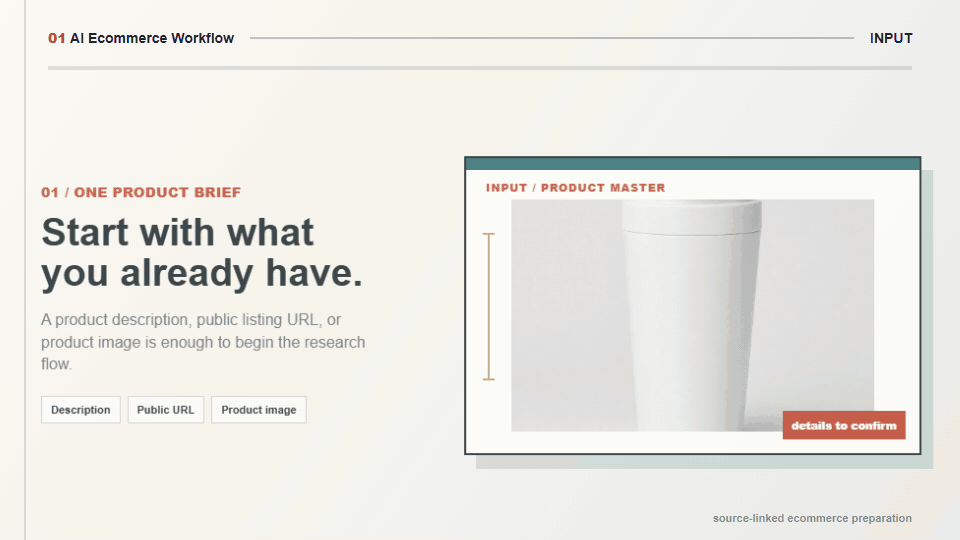

# AI Ecommerce Workflow

AI Ecommerce Workflow Skill for evidence-first public ecommerce market research, platform-specific listing drafts, and marketplace image requirements.

<table align="center"><tr><td><a href="https://github.com/mianbaofang/ai-ecommerce-workflow/releases"></a></td><td><a href="https://github.com/mianbaofang/ai-ecommerce-workflow/actions/workflows/deploy-pages.yml"></a></td><td><a href="LICENSE"></a></td><td><a href="https://github.com/mianbaofang/ai-ecommerce-workflow/stargazers"></a></td></tr></table>

<p align="center">
  <a href="https://mianbaofang.github.io/ai-ecommerce-workflow/docs/site/hyperframes-promo/index.html">
    
  </a>
</p>

<p align="center">
  <a href="README.zh-CN.md">中文 README</a>
  · <a href="SKILL.md">Skill</a>
  · <a href="https://mianbaofang.github.io/ai-ecommerce-workflow/docs/site/hyperframes-promo/index.html">Preview</a>
  · <a href="DISCLAIMER.md">Disclaimer</a>
  · <a href="ACKNOWLEDGEMENTS.md">Acknowledgements</a>
  · <a href="https://github.com/mianbaofang/ai-ecommerce-workflow/releases">Release</a>
  · <a href="SECURITY_AUDIT.md">Security audit</a>
</p>

## Start In One Minute

Most users do not need to install code. Give the repository root to a Skill-compatible Agent:

```text
https://github.com/mianbaofang/ai-ecommerce-workflow
```

Then ask:

```text
Install this Skill. Research public comparables, displayed prices, and common complaints for this travel mug. Give me a one-page brief first.
```

A public URL or uploaded image can be the only input. The provider question is non-blocking: the current run starts with capabilities already available in the host.

Chinese invocation template:

```text
【跑公开电商市场研究】
产品描述 / 公开商品链接 / 产品图片:
目标平台(可选):
地区与语言(可选):
需要平台文案和图片规格吗(是/否):
```

The Skill needs only one starting input: a product description, a public product URL, or product images. Platform, region, language, price/cost, known competitors, brand voice, and image needs are optional. The Skill asks only focused follow-up questions when the item cannot be identified.

## Why This Skill Exists

This Skill grew out of a recurring working scene: a seller has a product description, public link, or phone photo, but needs enough public evidence to decide whether and how to prepare a listing. The work then fractures across search tabs, platform fields, copy drafts, and image-size notes, while observed facts and unverified guesses get mixed together.

This Skill makes that handoff reviewable: it starts with the materials sellers already have, returns a short public-market brief first, and only produces platform-specific copy, image requirements, or an optional image brief after the user chooses a marketplace.

It combines public search evidence and user-provided materials into editable, source-linked research and listing-preparation drafts.

> Read [Disclaimer](DISCLAIMER.md) before use.

> **Validation status (2026-07-29):** The core Skill workflow passes representative public-search, category-copy, ten-platform image-requirement, and browser-report tests. See the [manual regression report](reports/manual-simulation/07-workflow-regression.md), [copy framework](references/product-copy-framework.md), and [complete ten-platform image-generation matrix](references/platform-image-specs.md).

## At A Glance

| Question | Answer |
|---|---|
| Who is it for? | Sellers and operators who need public competitor references and a usable first listing package. |
| What do I provide? | A product description, one public product URL, or a product image. Any one is enough to start. |
| What does it output? | A one-page market brief, Markdown evidence ledger, observed price ranges, and comparable links; platform copy and full image specs after marketplace selection. |
| How are Chinese marketplaces handled? | Taobao/Tmall, JD, Pinduoduo, Douyin, and Kuaishou use current leaf categories and official required properties before open taxonomies. |
| What does it protect? | Source clarity, public-search boundaries, product-claim caution, and human review before publishing. |
| How do I invoke it? | Ask naturally: “Research public comparables, displayed prices, and common complaints for this product.” |

## Invocation Details

For a more controlled run, use this Chinese invocation template:

```text
【跑公开电商市场研究】
产品描述 / 公开商品链接 / 产品图片:
目标平台(可选):
地区与语言(可选):
需要平台文案和图片规格吗:否
```

## Run Modes

| Mode | Use when | Output scope |
|---|---|---|
| Public market research | Start from a description, URL, or image | Observed price range, comparable links, public selling points, pain points, opportunities |
| Platform asset pack | A target marketplace has been selected | Platform titles, selling points, description, FAQ, keywords, complete image-requirement matrix |
| Optional image generation | The user has selected a model/tool and approved parameters | Reference-preserving prompts or host-provided image outputs |

## Capability Matrix

| Category | Feature | Dependency | Status |
|---|---|---|---|
| Core workflow | Input recognition, public research, and asset-pack contract | None | Built-in |
| Marketing | Comparable links and observed price bands | Host/public search or optional provider | Degrades to pending verification |
| Evidence | Markdown evidence ledger and source-state tracking | None | Built-in |
| Taxonomy | Chinese marketplace leaf-category and required-property precedence | Official public docs or user-selected backend category | Current rules require review |
| Copy | Humanized copy checks | Built-in rules | Built-in |
| Copy | Enhanced Chinese humanization | `anti-ai-tone`, `renhua`, or `humanizer-zh` | Optional |
| Review | Fact, full-sentence risk, category, and marketplace preflight | Built-in rules | Built-in |
| Review | Domestic content-platform or actual-media preflight | `yuwen-publish-precheck` / `media-publish-check` | Optional |
| Pages | Selected public page to Markdown | `huashu-md-html`, `autocli read`, or host reader | Optional |
| Compliance | Pre-delivery prohibited-term and claim review | Built-in reference list | Built-in rule |
| Evidence | Source trail per competitor claim | Manual URL/time tags | Built-in |
| Images | Size matrix, reference-preserving brief, and preflight | None | Built-in |
| Images | Actual image generation | User-provided model/tool | User provides |
| Data | Real transaction prices | User screenshots or authorized exports | User provides |

Default behavior: the Skill offers optional provider configuration once without blocking the current run; it never auto-installs one. When no public search capability is available, competitor links and prices are marked pending verification rather than inferred as facts.

## Optional Search Providers

The Skill uses public search capabilities already available in the host runtime. At first use, it asks whether the user wants to configure an optional provider. It never auto-installs providers or asks for keys in chat.

| Provider | Role | Default use |
|---|---|---|
| Host public search | Candidate discovery | Use when available |
| `anysearch` / `multi-search-engine` | Public web and multi-engine search | Optional |
| `Tavily` / `Brave Search` | Secondary public-search coverage | Optional |
| `agent-reach` | Public web and social-discussion discovery | Optional |
| `agentkey` | A host-provided public-search route, when available | Optional |

The package deliberately does not recommend `firecrawl-search`, `firecrawl-scrape`, browser crawler adapters, login-state access, proxy rotation, or anti-bot bypass. Public search results can identify candidate products and visible display prices, but they do not prove transaction prices, sales, keyword volume, or stable ranking. See [public-search-policy.md](references/public-search-policy.md).

### Selected-page Markdown

The workflow creates a Markdown evidence ledger before analysis. Markdown search output is normalized directly. A user-provided HTML/URL or a final cited page may be converted with an already installed `huashu-md-html`, `autocli read`, or equivalent host reader. This is single-page evidence handling, not catalog crawling. Failed reads remain `discovered only`.

> **Migration note:** `skill/SKILL.md` remains only as a compatibility redirect for older links. Use the repository-root `SKILL.md`; the former 15-item launch workflow is no longer supported as an execution route.

### Humanization

| Companion Skill | Role |
|---|---|
| `anti-ai-tone` | Removes visible template shells while preserving facts and uncertainty. |
| `renhua` | Rewrites Chinese copy into direct, concrete public language. |
| `humanizer-zh` | General Chinese humanization and rhythm adjustment. |

Use one primary optional rewrite pass by default, then revalidate every number, specification, material, function, condition, marketplace field, and prohibited claim. If none is installed, the built-in rules apply. No companion is auto-installed.

### Pre-publication review

The built-in review checks full-sentence meaning, evidence, category restrictions, marketplace consistency, and target market rather than treating every word hit as an automatic violation. It reports the exact location, missing evidence, smallest repair, and a review status, then reruns after changes. `yuwen-publish-precheck` is an optional extra only for supported domestic content platforms; `media-publish-check` applies only when actual short-video, cover, subtitle, spoken, or livestream assets exist. Neither is a universal marketplace approval service.

### Provider-neutral image generation

The Skill does not bundle any image-generation API. Users select the model or tool before generation; otherwise the Skill produces an image brief and prompt only.

### API keys

The Skill does not bundle any API keys. Provider keys stay in the user's host environment. The open-source repo stays provider-neutral.

## Compliance Gate

Every copy output is reviewed against the claim evidence and prohibited-term reference before delivery:

- Blocks absolute prohibited terms (advertising law red lines): superlatives, absolute claims, unsubstantiated certifications.
- Blocks platform-specific prohibited words for Taobao, Pinduoduo, Douyin, Amazon, Kuaishou, and 1688.
- Health, beauty, or medical claims without official certification are blocked and marked pending review.
- Triggered words trigger full rewrite, not just a warning tag.

Full prohibited term table with platform differences: [skill/references/compliance-terms.md](skill/references/compliance-terms.md).

## Evidence Traceability

Every competitor, price, sales, review, and certification claim must include a source trail:

```text
[Source: observation path + timestamp + price basis]
```

Valid source types: public page URL with observation time, search tool result, user screenshot or export filename, authorized analytics tool name, or a clear C/D inference label. Claims without a source trail cannot be labeled A or B evidence.

## Pricing Boundary

The default route reports public display prices only. It does not calculate a recommended final selling price, a paid-traffic plan, CPC, ROAS, or stop-loss rule. Those analyses require a separate request and user-supplied cost, logistics, commission, tax, and authorized performance data.

## Image Policy

The open-source Skill is provider-neutral. It outputs image prompts, material briefs, and preflight questions, but it does not hard-code any private image tooling.

Before any generation route is used, the Agent should confirm:

1. Model or tool.
2. Purpose: main image, detail scene, comparison image, or detail close-up.
3. Reference images and their rights.
4. Ratio, size, count, style, and text policy.
5. Output path or delivery format.

AI-generated images require a final fidelity, rights, and marketplace-compliance review before publishing.

For the full legal, marketplace, data-access, and business-performance boundaries, read [DISCLAIMER.md](DISCLAIMER.md).

## Acknowledgements

This workflow stands on a mix of open-source projects, public tooling, and service ecosystems:

- Optional public-search tools: `multi-search-engine`, `anysearch`, Tavily, Brave Search, `agent-reach`, and host-provided `agentkey` routes.
- Optional Chinese copy review: `anti-ai-tone`, `renhua`, `humanizer-zh`, and the built-in anti-template writing rules.
- Optional publication review: `yuwen-publish-precheck` for supported domestic content platforms and `media-publish-check` for actual media.
- Optional selected-page Markdown conversion: `huashu-md-html`, `autocli read`, or a host page reader.
- Marketplace compliance references: public advertising-law, platform-rule, and seller-operation knowledge distilled into `skill/references/compliance-terms.md`.

These tools help with discovery, drafting, and review. Real transaction prices, seller-center data, certificates, and final marketplace assets still need user-provided authorized evidence.

See [ACKNOWLEDGEMENTS.md](ACKNOWLEDGEMENTS.md) for the full attribution list.

## Repository Layout

```text
SKILL.md                        Canonical Skill entrypoint
agents/interface.yaml          Skill interface metadata
manifest.json                  Package, owner, and governance metadata
references/                    Search, copy, asset, and complete ten-platform image requirements
evals/                         Trigger and output evaluations
reports/manual-simulation/     Real search, image, browser, and regression evidence
skill/                         Compatibility redirect and historical references

docs/
  QUICK-START.md                 Chinese quick-start guide
  COMPANION-SKILLS.md            Companion skill detail and missing-skill behavior
  CAPABILITY-AUDIT.md            Per-feature dependency audit
  assets/                        README hero SVG, animated GIF, 1K visuals
  site/                          Project introduction pages and historical demo assets
  history/                       PM iteration notes and source-article records

tests/
  TEST-CASES.md                  Trigger/output regression cases

LICENSE                         MIT license
CONTRIBUTING.md                 How to contribute without leaking private APIs
```

## Safety And Reviewable Outputs

Each delivery keeps its public-source links, evidence ledger, platform fields, and editable copy or image brief together for review and handoff.

## Development Notes

There is no runtime dependency for normal Skill users. The canonical package starts at root `SKILL.md`, `agents/interface.yaml`, and `manifest.json`.

Suggested checks before release:

```bash
rg -n "API_KEY|SECRET|TOKEN|Bearer|sk-" .
rg -n "legacy Taobao-only naming|old trigger phrase" .
```

Lightweight eval cases: [tests/TEST-CASES.md](tests/TEST-CASES.md) and [skill/references/trigger-output-eval.md](skill/references/trigger-output-eval.md).

Full capability audit: [docs/CAPABILITY-AUDIT.md](docs/CAPABILITY-AUDIT.md).

Security audit: [SECURITY_AUDIT.md](SECURITY_AUDIT.md) — confirms no private API keys or caches are tracked.

## Status

The core Skill workflow is `PASS`. Trigger evaluation passes 6/6 positive and 4/4 negative cases, and output evaluation passes 11/11. Public search, the complete ten-platform image matrix, category copy, Markdown evidence, contextual listing review, responsive browser reports, and the HyperFrames animation have local execution evidence.

## Author

Ethan <ethan.zl@hotmail.com>

## License

MIT.
