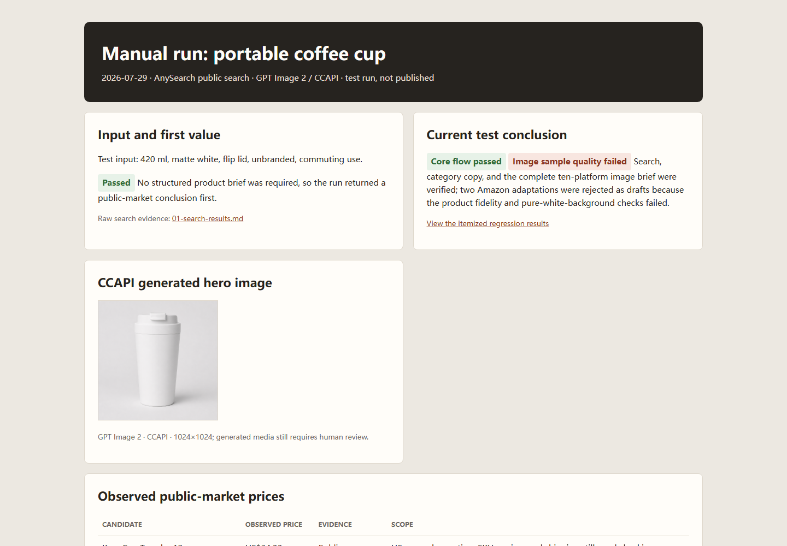
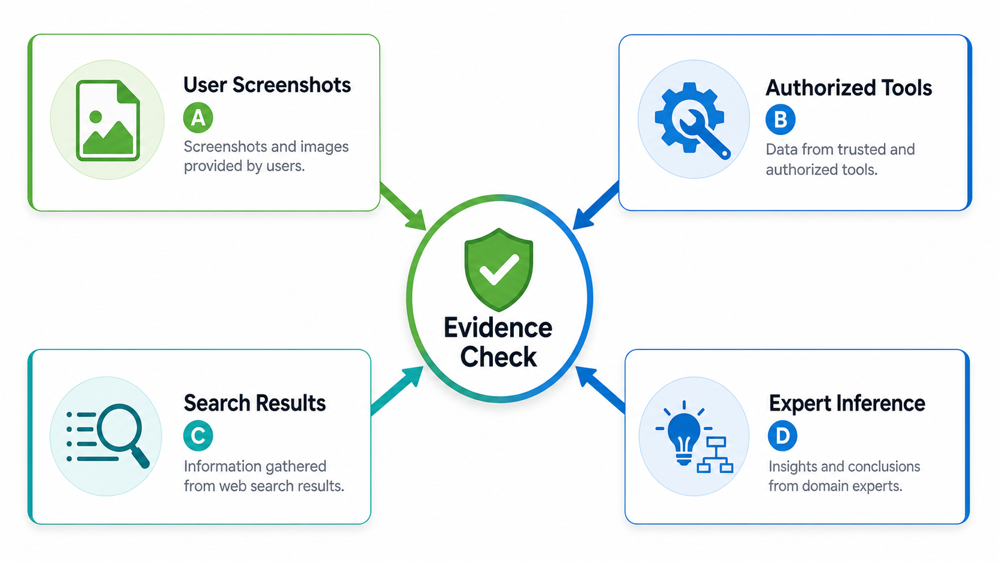

# AI Ecommerce Workflow

AI Ecommerce Workflow is an AI Ecommerce Workflow Skill for public ecommerce competitor research. As a product listing Skill, it turns a product description, public URL, or image into source-linked competitor and price evidence, then prepares platform-specific listing drafts and product listing image requirements for a selected marketplace. It is a Skill for research and editable handoff, not an auto-publishing bot.

<table align="center"><tr><td><a href="https://github.com/mianbaofang/ai-ecommerce-workflow/releases"></a></td><td><a href="https://github.com/mianbaofang/ai-ecommerce-workflow/actions/workflows/deploy-pages.yml"></a></td><td><a href="LICENSE"></a></td><td><a href="https://github.com/mianbaofang/ai-ecommerce-workflow/stargazers"></a></td></tr></table>

<p align="center">
  
  
  
  
  
</p>

<p align="center">
  <a href="https://mianbaofang.github.io/ai-ecommerce-workflow/readme-animation-en.html">
    
  </a>
</p>

<p align="center">
  <a href="README.zh-CN.md">中文 README</a>
  · <a href="https://github.com/mianbaofang/ai-ecommerce-workflow/blob/v1.1.1/skills/ai-ecommerce-workflow/SKILL.md">Published Skill (v1.1.1)</a>
  · <a href="https://mianbaofang.github.io/ai-ecommerce-workflow/readme-animation-en.html">Workflow demo</a>
  · <a href="DISCLAIMER.md">Disclaimer</a>
  · <a href="ACKNOWLEDGEMENTS.md">Acknowledgements</a>
  · <a href="CHANGELOG.md">Changelog</a>
  · <a href="SECURITY_AUDIT.md">Security audit</a>
</p>

## Start In One Minute

Most users do not need to install code. The currently published `v1.1.1` entry is `skills/ai-ecommerce-workflow/`. Give the repository to a Skill-compatible Agent, or preview and install that published entry with GitHub CLI:

```text
https://github.com/mianbaofang/ai-ecommerce-workflow
```

```bash
gh skill preview mianbaofang/ai-ecommerce-workflow skills/ai-ecommerce-workflow@v1.1.1
gh skill install mianbaofang/ai-ecommerce-workflow skills/ai-ecommerce-workflow@v1.1.1 --agent universal --scope user
```

The package path is the same in the source tree and in the v1.1.1 release asset. GitHub's automatic source archive is not the install asset; use the release ZIP and checksum when a standalone archive is required.

Then ask:

```text
Install this Skill. Research public comparables, displayed prices, and common complaints for this travel mug. Give me a one-page brief first.
```

A public URL or uploaded image can be the only input. The provider question is non-blocking: the current run starts with capabilities already available in the host.

For a structured request, paste:

```text
Product description / public product URL / product images:
Target marketplace (optional):
Region and language (optional):
Need listing copy and image requirements? (yes/no):
```

The Skill needs only one starting input: a product description, a public product URL, or product images. Platform, region, language, price/cost, known competitors, brand voice, and image needs are optional. The Skill asks only focused follow-up questions when the item cannot be identified.

## Why This Skill Exists

Product work often starts with three messy inputs: a pasted listing URL, a phone photo, or a few lines of description. Before anyone writes a title, they still need to separate what a public page shows from what is only a guess, and decide which marketplace fields are still unknown. In a typical handoff those notes sit in separate tabs, screenshots, and copy drafts, so an observed display price can be mistaken for a transaction fact.

The Skill keeps that first decision small and reviewable. It records public competitor links and price context with source state, returns a one-page brief before asking for a marketplace, and only then prepares marketplace listing copy, image requirements, or an optional image brief. The result is an editable handoff rather than a finished listing presented as verified fact.

AI Ecommerce Workflow is for sellers, operators, and agents preparing public-market research and marketplace assets. It is built for public ecommerce market research where competitor price evidence matters, then carries that evidence into marketplace listing copy and product image requirements. It is provider-neutral, does not log in or publish on the user's behalf, and marks missing evidence for review.

> Read [Disclaimer](DISCLAIMER.md) before use.

> **Recorded workflow evidence (2026-07-29):** The core Skill workflow passed representative public-search, category-copy, ten-platform image-requirement, and browser-report tests. See the [manual regression report](reports/manual-simulation/07-workflow-regression.md), [copy framework](skills/ai-ecommerce-workflow/references/product-copy-framework.md), and [complete ten-platform image-requirement matrix](skills/ai-ecommerce-workflow/references/platform-image-specs.md).

## At A Glance

| Question | Answer |
|---|---|
| Who is it for? | Sellers and operators who need public competitor references and a usable first listing package. |
| What do I provide? | A product description, one public product URL, or a product image. Any one is enough to start. |
| What does it output? | A one-page market brief, Markdown evidence ledger, observed price ranges, and comparable links; platform copy and full image specs after marketplace selection. |
| How are Chinese marketplaces handled? | Taobao/Tmall, JD, Pinduoduo, Douyin, and Kuaishou use current leaf categories and official required properties before open taxonomies. |
| What does it protect? | Source clarity, public-search boundaries, product-claim caution, and human review before publishing. |
| How do I invoke it? | Ask naturally: “Research public comparables, displayed prices, and common complaints for this product.” |

## Invocation Details

For a more controlled run, use this template:

```text
[PUBLIC ECOMMERCE MARKET RESEARCH]
Product description / public product URL / product image:
Target marketplace (optional):
Region and language (optional):
Need listing copy and image requirements? No
```

### How It Runs After Installation

1. Identify the product and separate confirmed facts, image-visible details, and items that still need confirmation.
2. Search public candidates and normalize search summaries and readable page content into a Markdown evidence ledger.
3. Return a one-page brief before asking the user to choose a marketplace.
4. After marketplace and category selection, prepare platform copy and image requirements; confirm the model and parameters before any image-generation route.

## Run Modes

| Mode | Use when | Output scope |
|---|---|---|
| Public market research | Start from a description, URL, or image | Observed price range, comparable links, public selling points, pain points, opportunities |
| Platform asset pack | A target marketplace has been selected | Platform titles, selling points, description, FAQ, keywords, complete image-requirement matrix |
| Optional image generation | The user has selected a model/tool and approved parameters | Reference-preserving prompts or host-provided image outputs |

## Capability Matrix

| Category | Feature | Dependency | Status |
|---|---|---|---|
| Core workflow | Input recognition, public research, and asset-pack contract | None | Built-in |
| Marketing | Comparable links and observed price bands | Host/public search or optional provider | Degrades to pending verification |
| Evidence | Markdown evidence ledger and source-state tracking | None | Built-in |
| Taxonomy | Chinese marketplace leaf-category and required-property precedence | Official public docs or user-selected backend category | Current rules require review |
| Copy | Humanized copy checks | Built-in rules | Built-in |
| Copy | Enhanced Chinese humanization | `anti-ai-tone`, `renhua`, or `humanizer-zh` | Optional |
| Review | Fact, full-sentence risk, category, and marketplace preflight | Built-in rules | Built-in |
| Review | Domestic content-platform or actual-media preflight | `yuwen-publish-precheck` / `media-publish-check` | Optional |
| Pages | Selected public page to Markdown | `huashu-md-html`, `autocli read`, or host reader | Optional |
| Compliance | Pre-delivery prohibited-term and claim review | Built-in reference list | Built-in rule |
| Evidence | Source trail per competitor claim | Manual URL/time tags | Built-in |
| Images | Size matrix, reference-preserving brief, and preflight | None | Built-in |
| Images | Actual image generation | User-provided model/tool | User provides |
| Data | Real transaction prices | User screenshots or authorized exports | User provides |

Default behavior: the Skill offers optional provider configuration once without blocking the current run; it never auto-installs one. When no public search capability is available, competitor links and prices are marked pending verification rather than inferred as facts.

## Preview

The first row contains a real desktop capture from the manual run and a generated product output. The second row contains workflow and evidence illustrations; those images explain the contract and are not live application screens. Open an image to inspect the full-size repository asset.

<table align="center"><tr><td><a href="https://github.com/mianbaofang/ai-ecommerce-workflow/blob/main/docs/site/run-report-en.png"></a></td><td><a href="https://github.com/mianbaofang/ai-ecommerce-workflow/blob/main/reports/manual-simulation/showcase-1200x900.png"></a></td></tr></table>

<table align="center"><tr><td><a href="https://github.com/mianbaofang/ai-ecommerce-workflow/blob/main/docs/site/workflow-1k.png"></a></td><td><a href="https://github.com/mianbaofang/ai-ecommerce-workflow/blob/main/docs/site/evidence-1k.png"></a></td></tr></table>

## Optional Search Providers

The Skill uses public search capabilities already available in the host runtime. At first use, it asks whether the user wants to configure an optional provider. It never auto-installs providers or asks for keys in chat.

| Provider | Role | Default use |
|---|---|---|
| Host public search | Candidate discovery | Use when available |
| `anysearch` / `multi-search-engine` | Public web and multi-engine search | Optional |
| `Tavily` / `Brave Search` | Secondary public-search coverage | Optional |
| `agent-reach` | Public web and social-discussion discovery | Optional |
| `agentkey` | A host-provided public-search route, when available | Optional |

The package deliberately does not recommend `firecrawl-search`, `firecrawl-scrape`, browser crawler adapters, login-state access, proxy rotation, or anti-bot bypass. Public search results can identify candidate products and visible display prices, but they do not prove transaction prices, sales, keyword volume, or stable ranking. See [public-search-policy.md](skills/ai-ecommerce-workflow/references/public-search-policy.md).

> **Package note:** The current public release is `v1.1.1`, with [`skills/ai-ecommerce-workflow/SKILL.md`](skills/ai-ecommerce-workflow/SKILL.md) as its automatic-discovery entry. The root `manifest.json` mirrors package metadata for repository tooling; the retired root and `skill/` entries are not separate products.

### Public Discovery

| Companion Skill | Role | Example in competitor research |
|---|---|---|
| `anysearch` | Public web search and recent-source discovery | Candidate links and search summaries |
| `multi-search-engine` | Multi-engine public candidate discovery | Cross-engine candidate links |
| `Tavily` / `Brave Search` | Optional public search and cross-checking | User-configured secondary coverage |
| `agent-reach` | Optional public web and social-discussion discovery | User-configured discussion sources |
| `agentkey` | Host-provided public-search route | Use only when supported by the host |

These tools can identify public candidates and visible observations, but cannot prove transaction prices, post-coupon prices, login-state prices, sales, keyword volume, or stable organic ranking. Bulk crawling and protected pages are outside the default scope.

### Selected-page Markdown

The workflow creates a Markdown evidence ledger before analysis. Markdown search output is normalized directly. A user-provided HTML/URL or a final cited page may be converted with an already installed `huashu-md-html`, `autocli read`, or equivalent host reader. This is single-page evidence handling, not catalog crawling. Failed reads remain `discovered only`.

### Humanization

| Companion Skill | Role |
|---|---|
| `anti-ai-tone` | Removes visible template shells while preserving facts and uncertainty. |
| `renhua` | Rewrites Chinese copy into direct, concrete public language. |
| `humanizer-zh` | General Chinese humanization and rhythm adjustment. |

Use one primary optional rewrite pass by default, then revalidate every number, specification, material, function, condition, marketplace field, and prohibited claim. If none is installed, the built-in rules apply. No companion is auto-installed.

### Pre-publication review

The built-in review checks full-sentence meaning, evidence, category restrictions, marketplace consistency, and target market rather than treating every word hit as an automatic violation. It reports the exact location, missing evidence, smallest repair, and a review status, then reruns after changes. `yuwen-publish-precheck` is an optional extra only for supported domestic content platforms; `media-publish-check` applies only when actual short-video, cover, subtitle, spoken, or livestream assets exist. Neither is a universal marketplace approval service.

### Provider-neutral image generation

The Skill does not bundle any image-generation API. Users select the model or tool before generation; otherwise the Skill produces an image brief and prompt only.

### API keys

The Skill does not bundle any API keys. Provider keys stay in the user's host environment. The open-source repo stays provider-neutral.

## Compliance Gate

Every copy output is reviewed against the claim evidence and prohibited-term reference before delivery:

- Blocks absolute prohibited terms (advertising law red lines): superlatives, absolute claims, unsubstantiated certifications.
- Blocks platform-specific prohibited words for Taobao, Pinduoduo, Douyin, Amazon, Kuaishou, and 1688.
- Health, beauty, or medical claims without official certification are blocked and marked pending review.
- Triggered words trigger full rewrite, not just a warning tag.

Full prohibited term table with platform differences: [compliance-terms.md](skills/ai-ecommerce-workflow/references/compliance-terms.md).

## Evidence Traceability

Every competitor, price, sales, review, and certification claim must include a source trail:

```text
[Source: observation path + timestamp + price basis]
```

Valid source types: public page URL with observation time, search tool result, user screenshot or export filename, authorized analytics tool name, or a clear C/D inference label. Claims without a source trail cannot be labeled A or B evidence.

## Pricing Boundary

The default route reports public display prices only. It does not calculate a recommended final selling price, a paid-traffic plan, CPC, ROAS, or stop-loss rule. Those analyses require a separate request and user-supplied cost, logistics, commission, tax, and authorized performance data.

## Image Policy

The open-source Skill is provider-neutral. It outputs image prompts, material briefs, and preflight questions, but it does not hard-code any private image tooling.

Before any generation route is used, the Agent should confirm:

1. Model or tool.
2. Purpose: main image, detail scene, comparison image, or detail close-up.
3. Reference images and their rights.
4. Ratio, size, count, style, and text policy.
5. Output path or delivery format.

AI-generated images require a final fidelity, rights, and marketplace-compliance review before publishing.

For the full legal, marketplace, data-access, and business-performance boundaries, read [DISCLAIMER.md](DISCLAIMER.md).

## Safety And Reviewable Outputs

Each delivery keeps its public-source links, evidence ledger, platform fields, and editable copy or image brief together for review and handoff. The Skill does not prove transaction prices, sales, keyword volume, ranking, product certifications, or marketplace approval; read [Disclaimer](DISCLAIMER.md) before using an output.

## Acknowledgements

This workflow stands on a mix of open-source projects, public tooling, and service ecosystems:

- Optional public-search tools: `multi-search-engine`, `anysearch`, Tavily, Brave Search, `agent-reach`, and host-provided `agentkey` routes.
- Optional Chinese copy review: `anti-ai-tone`, `renhua`, `humanizer-zh`, and the built-in anti-template writing rules.
- Optional publication review: `yuwen-publish-precheck` for supported domestic content platforms and `media-publish-check` for actual media.
- Optional selected-page Markdown conversion: `huashu-md-html`, `autocli read`, or a host page reader.
- Marketplace compliance references: public advertising-law, platform-rule, and seller-operation knowledge distilled into `skills/ai-ecommerce-workflow/references/compliance-terms.md`.

These tools help with discovery, drafting, and review. Real transaction prices, seller-center data, certificates, and final marketplace assets still need user-provided authorized evidence.

See [ACKNOWLEDGEMENTS.md](ACKNOWLEDGEMENTS.md) for the full attribution list.

## Repository Layout

```text
skills/ai-ecommerce-workflow/   Published v1.1.1 self-contained Skill package
  SKILL.md                      Discoverable Skill entrypoint
  VERSION                       Package version
  LICENSE                       Package license
  manifest.json                 Installable package metadata
  agents/interface.yaml         Skill interface metadata
  references/                   Search, copy, asset, and image requirements
evals/                         Trigger and output evaluations
reports/manual-simulation/     Real search, image, browser, and regression evidence
docs/                           Guides, visual assets, and public Pages site

docs/QUICK-START.md             Chinese quick-start guide
docs/COMPANION-SKILLS.md        Companion skill detail and missing-skill behavior
docs/CAPABILITY-AUDIT.md        Per-feature dependency audit
docs/assets/                    README hero SVG and animated GIFs
docs/site/                      Project pages and full-size screenshots

tests/
  TEST-CASES.md                  Trigger/output regression cases

LICENSE                         MIT license
manifest.json                   Repository copy of the package metadata
CONTRIBUTING.md                 How to contribute without leaking private APIs
```

## Development Notes

There is no runtime dependency for normal Skill users. The install boundary is `skills/ai-ecommerce-workflow/`; its `SKILL.md`, `VERSION`, `LICENSE`, `manifest.json`, `agents/interface.yaml`, and `references/*.md` travel together. Evaluation fixtures, reports, tests, scripts, documentation, media, and release artifacts stay in the source repository and are not part of the install archive. The root `manifest.json` mirrors the package metadata for repository tooling; it is not a second install entry.

Suggested checks before release:

```bash
rg -n "API_KEY|SECRET|TOKEN|Bearer|sk-" .
rg -n "legacy Taobao-only naming|old trigger phrase" .
```

Lightweight eval cases: [tests/TEST-CASES.md](tests/TEST-CASES.md) and [evals/trigger-cases.md](evals/trigger-cases.md).

Full capability audit: [docs/CAPABILITY-AUDIT.md](docs/CAPABILITY-AUDIT.md).

Security audit: [SECURITY_AUDIT.md](SECURITY_AUDIT.md) confirms no private API keys or caches are tracked.

## Release Status

- Published release: [`v1.1.1`](https://github.com/mianbaofang/ai-ecommerce-workflow/releases/tag/v1.1.1). Its install boundary is [`skills/ai-ecommerce-workflow/`](skills/ai-ecommerce-workflow/); v1.1.0 used the former repository-root layout.
- The install asset is `ai-ecommerce-workflow-v1.1.1.zip` with a matching `.sha256` checksum; GitHub's automatic source ZIP is not the install asset.
- Local checks: 6/6 positive and 4/4 negative trigger cases, 11/11 output cases, Yao production governance validation, package validation, clean-install validation, and the official Agent Skills validation all pass.

## License

MIT.

<p align="center">
  Maintained by <a href="https://github.com/mianbaofang">mianbaofang</a>
  &middot;
  <a href="mailto:ethan.zl@hotmail.com">ethan.zl@hotmail.com</a>
  &middot;
  <a href="https://github.com/mianbaofang/ai-ecommerce-workflow/issues">Issues / contact</a>
</p>
