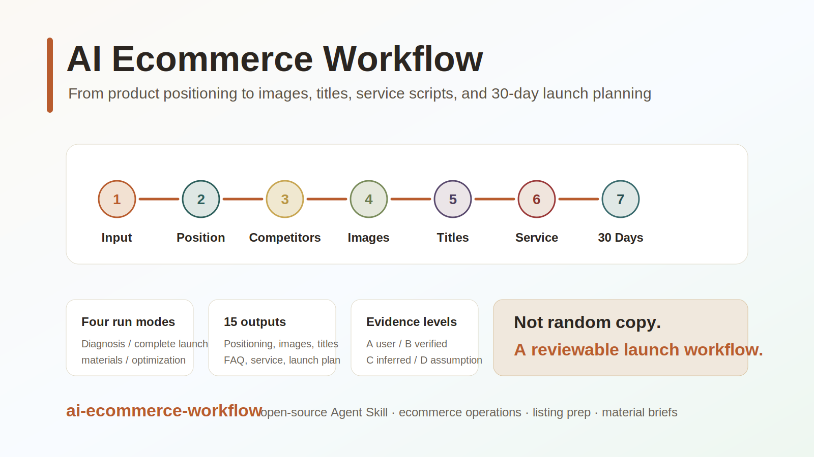

# AI 电商新品上架工作流 Skill

<p align="center">
  
</p>

## 为什么做这个 Skill

电商新品上架不是写几句文案那么简单。真正能交给团队执行的上架资料包，通常要先定产品定位、拆竞品价格带、从评论里挖痛点、规划主图和详情页、生成平台标题和关键词、准备 FAQ 与客服话术，再安排 7 天测款、14 天起量和 30 天稳定动作。

`ai-ecommerce-workflow` 把这些工作整理成一套 AI Agent 可执行的结构化流程。它适合运营、品牌方、设计协作团队、跨境卖家和正在搭建电商自动化流程的人使用。

它不是自动发布工具，也不替代运营拍板。它负责把“上架前准备”做成可复核、可分工、可继续迭代的工作包。

<p align="center">
  <a href="docs/site/project-intro-animation.html">
    
  </a>
</p>

<p align="center">
  <a href="README.md">English</a>
  ·
  <a href="skill/">Skill</a>
  ·
  <a href="skill/templates/user-input-form.md">调用表单</a>
  ·
  <a href="skill/examples/commute-backpack.md">完整示例</a>
  ·
  <a href="docs/QUICK-START.md">快速上手</a>
  ·
  <a href="docs/COMPANION-SKILLS.md">配套数据 Skill</a>
  ·
  <a href="skill/references/compliance-terms.md">合规禁词表</a>
  ·
  <a href="CHANGELOG.md">更新日志</a>
</p>

## 能做什么

完整运行时，Skill 会输出 15 项标准内容，并把结果拆成不同角色能拿走执行的交付包。

| 层级 | 输出内容 |
|---|---|
| 战略层 | 产品定位、目标用户、核心卖点、用户痛点 |
| 市场层 | 竞品价格带分析、差异化机会 |
| 视觉层 | 主图策划、详情页结构、设计 Brief |
| 流量层 | 平台分版本标题、20 个标题测试池、关键词三层 |
| 客服层 | 评论洞察、FAQ、客服话术 |
| 运营层 | 7 天测款、14 天起量、30 天稳定计划 |
| 交付层 | 运营决策包、设计制作包、客服话术包、老板审批包、素材生成包 |

关键结论会标注证据等级，避免把 AI 推断当事实：

| 等级 | 含义 |
|---|---|
| A | 用户明确提供的资料、截图、表格或后台导出 |
| B | 授权工具导出或公开页面可复核观察值 |
| C | 行业常识推断 |
| D | 强假设，必须人工复核 |

## 竞品数据从哪里来

这套工作流设计为：在用户 Agent 环境已经安装对应 companion skills 时，默认自动调用搜索和抓取能力，再做竞品价格带分析、标题关键词和评论洞察。

推荐默认配套的数据获取 Skill：

| Companion Skill / 工具 | 自动用于 | 不能替代什么 |
|---|---|---|
| `multi-search-engine` | 多搜索引擎发现候选竞品、交叉验证公开资料 | 真实成交价、登录后价格、平台后台数据 |
| `anysearch` | 全网搜索、候选竞品发现、公开资料检索 | 真实成交价、登录后价格、平台后台数据 |
| `firecrawl-search` | 搜索公开商品页、测评页、品牌页、文章 | 券后价、App 内价格、卖家后台数据 |
| `firecrawl-scrape` | 读取指定公开 URL 的 markdown/html/screenshot | 登录态页面、完整 SKU 弹层价格、强反爬页面 |
| `agent-reach` | 跨平台搜索、小红书/B站/Reddit/Twitter 等内容观察 | 电商后台成交价、销量和商业数据 |
| Tavily 或类似搜索 API | 当前环境已安装时做搜索和网页摘要 | 授权平台数据 |
| 用户截图/后台/第三方工具导出 | 生意参谋、蝉妈妈、飞瓜、卖家精灵、Keepa、Jungle Scout、Helium 10 等 | 需要记录来源、时间和价格口径 |

如果某个 companion Skill 没安装，Agent 应明确告诉用户缺哪个，同时继续使用已有工具；受影响的竞品价格、销量、评论结论必须标注【待核验】。搜索和抓取工具只能帮助发现竞品和读取公开页面观察值。除非用户提供授权后台、第三方工具导出或可复核截图，否则不能把页面展示价写成真实成交价。

## 能力矩阵

| 分类 | 功能 | 依赖 | 状态 |
|---|---|---|---|
| 核心流程 | 输入验证、运行模式、输出合同 | 无 | ✅ 内置可执行 |
| 核心流程 | 15 项上架模块 | 无 | ✅ 内置可执行 |
| 市场层 | 竞品价格带分析 | 任一 companion search/scrape tool | ⚠️ 需 Skill |
| 文案 | 去AI味质检 | 无（内置规则） | ✅ 内置可执行 |
| 文案 | 增强去AI味 | humanizer-zh skill | ⚠️ 需 Skill |
| 生图 | Prompt 建议和 preflight | 无 | ✅ 内置可执行 |
| 生图 | 实际生成图片 | 用户指定模型/工具 | 🔧 需用户提供 |
| 视频 | 分镜和 prompt 建议 | 无 | ✅ 内置可执行 |
| 视频 | 实际生成视频 | 用户指定视频工具 | 🔧 需用户提供 |
| 数据 | 竞品发现和页面读取 | companion search/scrape skills | ⚠️ 需 Skill |
| 数据 | 成交价/销量 | 用户截图或授权工具导出 | 🔧 需用户提供 |

## 快速使用

普通用户不需要安装代码。把下面这个 Skill 路径发给支持 Skill 的 Agent：

```text
https://github.com/mianbaofang/ai-ecommerce-workflow/tree/main/skill
```

然后说：

```text
请安装这个 Skill，然后帮我跑一个电商新品完整上架流程。
```

也可以直接复制这个模板：

```text
【跑电商新品上架流程】
运行模式:完整上架
产品名称:通勤收纳双肩包
产品类目:箱包 / 通勤包
一句话描述:大容量通勤双肩包,能放 15.6 寸电脑,干湿分区,防泼水面料
目标平台:淘宝 + 拼多多
售价区间:109-159元
预估成本:45元
```

开始前 Agent 应先检查 3 个必填项：

1. 产品名称 + 一句话描述。
2. 产品类目。
3. 目标平台。

其他字段都是选填，但会影响精度：产品图、售价与成本、测款预算、首批库存、发货能力、已知竞品、文案口吻、生图或视频需求等。

## 运行模式

| 模式 | 适合场景 | 输出范围 |
|---|---|---|
| 快速诊断 | 只想先判断这个品值不值得做 | 定位、用户、痛点、竞品、机会摘要 |
| 完整上架 | 从零准备上架资料包 | 全 15 项 + 角色分工 |
| 素材制作 | 方向已定，只要主图/详情页/标题/素材 prompt | 卖点、主图、详情页、标题、设计 Brief、可选生图/视频 prompt |
| 上架后优化 | 已经上架，但点击或转化不好 | 竞品复盘、标题关键词、评论洞察、客服与优化计划 |

## 生图与视频原则

开源版不绑定任何私有生图或视频工具。Skill 只定义素材生成前必须确认的信息、prompt 结构和质量检查标准。

进入生图或视频分支前，Agent 必须确认：

1. 使用哪个模型或工具。
2. 用途：主图、详情页场景图、对比图、细节图、主图视频、短视频，还是只要分镜/prompt。
3. 参考图与授权来源。
4. 比例、尺寸、张数、风格、是否允许文字。
5. 输出路径或交付方式。

AI 图和 AI 视频只作为创意参考，真实上架素材仍然需要实拍、授权和平台合规复核。

## 合规拦截门

所有文案输出前必须经过合规自动检测。拦截规则包括：

- 广告法红线词：最、第一、顶级、100%、纯天然、零添加、永不、永久、国家级、世界级、全网、全国、全球 等极限词和绝对词——检测到直接退回改写，不配警告标签。
- 平台特定禁词：淘宝、拼多多、抖音、亚马逊、快手、1688 各有不同的标题和描述规则，输出时会自动适配。
- 功效/认证/安全类宣称，没有官方资质文件时标注【人工复核】、不允许直接输出。
- 完整规则表和平台差异详见 `skill/references/compliance-terms.md`。

## 来源迹追溯

每条涉及竞品、价格、销量、评论、认证、材质来源的结论，必须附带来源迹：

```text
[来源: 观察路径 + 时间 + 口径]
```

有效来源包括：公开 URL 和观察时间、工具搜索记录、用户截图或导出文件名、授权工具名称、或明确的 C/D 推断标注。没有来源迹的结论不得进入 B 级以上证据。

## 预算与止损规则

未提供预算时默认只输出免费/低预算方案（≤100 元/天），不做付费投流计划。任何付费投流建议必须附带 Kill Switch：

- 日预算上限。
- 单次点击成本上限（CPC），超过暂停。
- 投产比下限（ROI），连续 3 天未达标关停。
- 检查周期。
- 停止动作：暂停计划、换素材、降价、关停。

测款期（D1-D7）禁止单日消耗超过预算 50%。起量期（D8-D14）如果 ROI 持续低于 1.0，自动转入只优化不消耗模式。

## 仓库结构

```text
skill/
  SKILL.md                         Agent 使用的主流程说明
  agents/interface.yaml            Skill 列表和界面元数据
  templates/user-input-form.md     可复制调用表单
  examples/                        调用样例和完整输出示例
  references/                      输出合同、角色分工、价格带方法、触发评测

docs/
  QUICK-START.md                   中文快速上手
  assets/                          README 封面图和 GIF 预览
  site/                            HTML 动画源文件
  history/                         PM 迭代记录和文章方法论融合记录

tests/
  TEST-CASES.md                    轻量触发与输出回归用例
```

## 边界

这个 Skill 不做以下事情：

- 直接登录平台后台发布商品；
- 生成假评论、买家秀或刷单话术；
- 编造认证、检测报告、功效、安全承诺；
- 未授权抓取受保护平台数据；
- 把 AI 推断出来的市场数据写成已核验事实；
- 把私有 API key 或私有生图/视频路线写进开源仓库。

## 开发者说明

普通使用不需要安装依赖。核心交付物是 `skill/` 目录。

发布前建议跑两类检查：

```bash
rg -n "API_KEY|SECRET|TOKEN|Bearer|sk-" .
rg -n "legacy Taobao-only naming|old trigger phrase" .
```

轻量评测用例在 `tests/TEST-CASES.md` 和 `skill/references/trigger-output-eval.md`。

## License

MIT.
