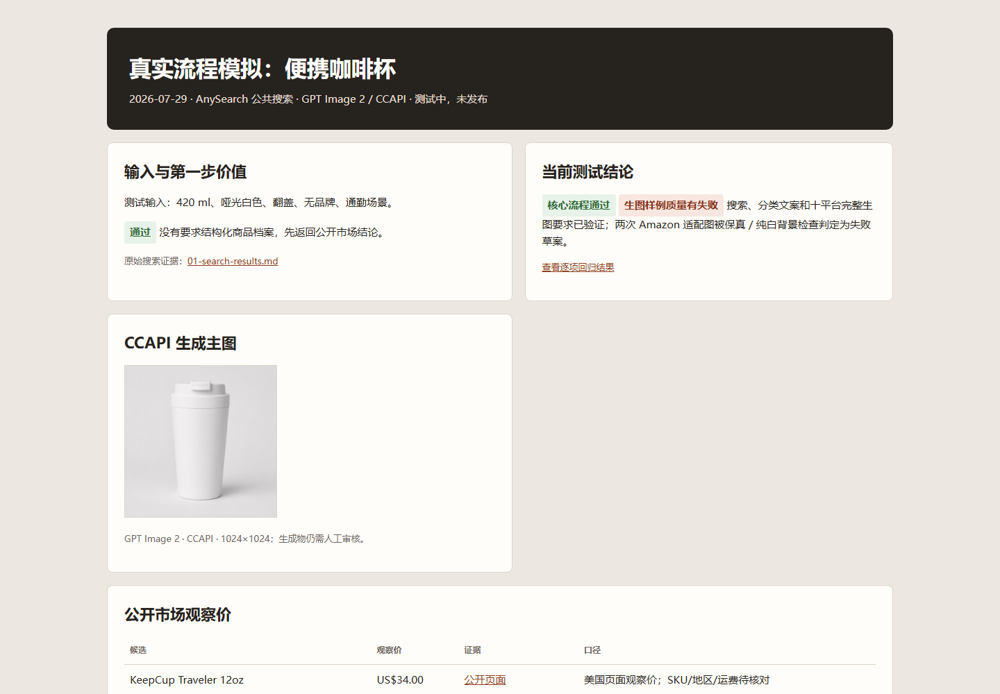
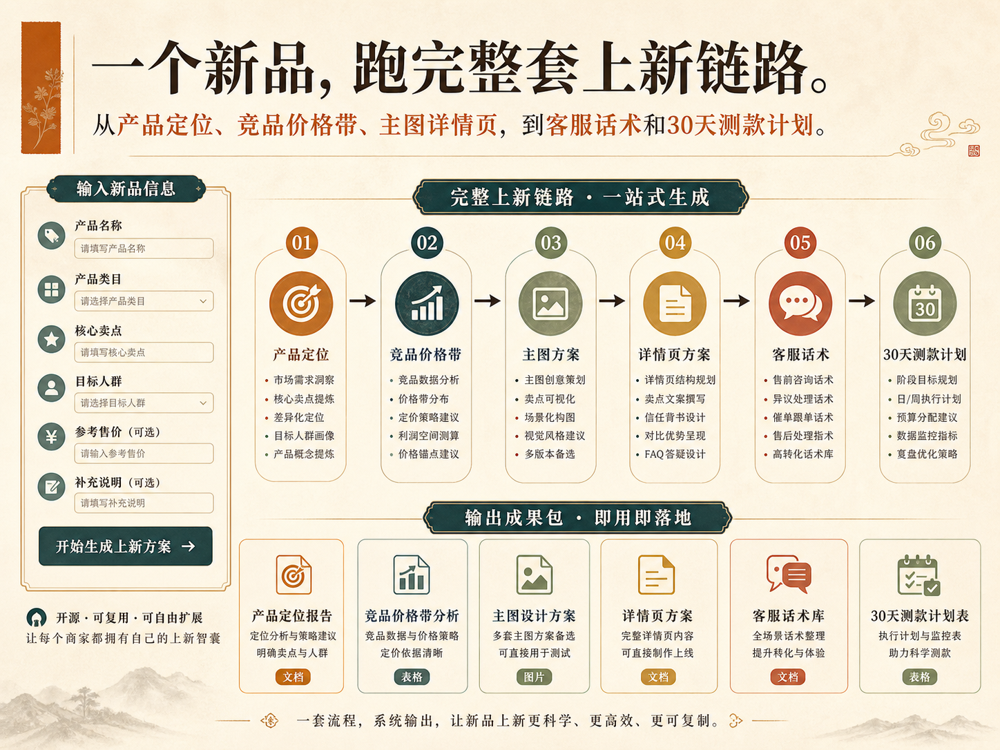
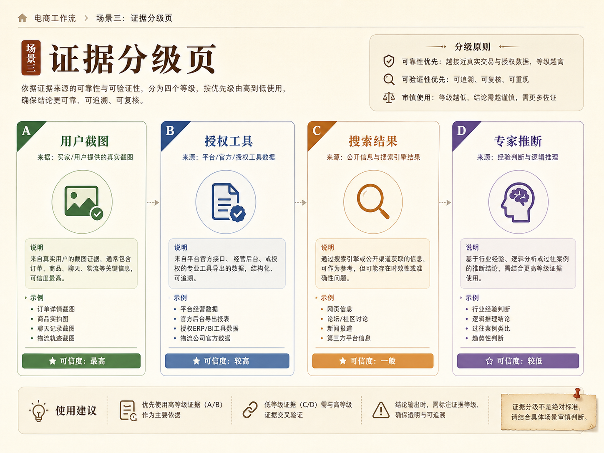

# AI 电商公开市场研究与素材包

AI 电商公开市场研究与素材包是一个电商市场研究 Skill：从商品描述、公开链接或产品图片开始，整理带来源的竞品与页面观察价格证据，再按目标平台准备上架文案和商品图片规格。它用于研究和可编辑交接，不会自动发布商品。

<table align="center"><tr><td><a href="https://github.com/mianbaofang/ai-ecommerce-workflow/releases"></a></td><td><a href="https://github.com/mianbaofang/ai-ecommerce-workflow/actions/workflows/deploy-pages.yml"></a></td><td><a href="LICENSE"></a></td><td><a href="https://github.com/mianbaofang/ai-ecommerce-workflow/stargazers"></a></td></tr></table>

<p align="center">
  
  
  
  
  
</p>

<p align="center">
  <a href="https://mianbaofang.github.io/ai-ecommerce-workflow/hyperframes-promo/">
    
  </a>
</p>

<p align="center">
  <a href="README.md">English</a>
  · <a href="https://github.com/mianbaofang/ai-ecommerce-workflow/blob/v1.1.1/skills/ai-ecommerce-workflow/SKILL.md">已发布 Skill（v1.1.1）</a>
  · <a href="https://mianbaofang.github.io/ai-ecommerce-workflow/hyperframes-promo/">流程演示</a>
  · <a href="DISCLAIMER.md">免责声明</a>
  · <a href="ACKNOWLEDGEMENTS.md">致谢</a>
  · <a href="CHANGELOG.md">更新日志</a>
  · <a href="SECURITY_AUDIT.md">安全审计</a>
</p>

## 快速开始

普通用户不需要安装代码。当前已经公开的 `v1.1.1` 入口是 `skills/ai-ecommerce-workflow/`。把仓库交给支持 Skill 的 Agent，也可以用 GitHub CLI 预览或安装这个已发布入口：

```text
https://github.com/mianbaofang/ai-ecommerce-workflow
```

```bash
gh skill preview mianbaofang/ai-ecommerce-workflow skills/ai-ecommerce-workflow@v1.1.1
gh skill install mianbaofang/ai-ecommerce-workflow skills/ai-ecommerce-workflow@v1.1.1 --agent universal --scope user
```

源码中的包路径与 v1.1.1 发布资产一致。需要独立压缩包时，请使用 Release 中的 ZIP 和校验文件；GitHub 自动生成的源代码 ZIP 不是安装包。

然后直接提出任务：

```text
请安装这个 Skill。帮我研究这款便携咖啡杯的公开同类、页面观察价格和常见差评，先给一页结论。
```

公开商品链接或上传的产品图片也可以作为唯一输入；首次询问搜索能力不会阻断当前研究。

## 为什么做这个 Skill

电商工作经常从三种不完整的输入开始：一条商品链接、一张手机照片，或者几句产品描述。真正写标题之前，还要先分清公开页面展示了什么、哪些只是推测，以及目标平台还缺哪些字段。现实交接里，这些内容往往散在搜索标签页、截图和文案草稿中，页面观察价格也容易被误写成成交价。

这个 Skill 把第一步缩小成一份可以复核的工作：记录公开竞品链接、价格语境和来源状态，先给一页结论，等用户选定平台后再准备平台文案、图片规格和可选生图 brief。交付的是可编辑的上架准备材料，不把未经确认的内容包装成成品。

它面向商家、运营人员和 Agent 用户，保持供应商中立，不登录、不代发布；缺少证据的地方会明确留给人工复核。

> 使用前请阅读 [免责声明](DISCLAIMER.md)。

> **实测工作流记录（2026-07-29）：** 核心 Skill 已通过公开搜索、分类文案、十平台图片要求和浏览器报告等代表性测试。查看 [实测回归报告](reports/manual-simulation/07-workflow-regression.md)、[商品文案框架](skills/ai-ecommerce-workflow/references/product-copy-framework.md) 和 [十平台图片要求表](skills/ai-ecommerce-workflow/references/platform-image-specs.md)。

## 一眼看懂

| 问题 | 回答 |
|---|---|
| 适合谁 | 需要公开竞品参考和可用首版素材的商家、运营和 Agent 用户。 |
| 给它什么 | 商品描述、一个公开商品链接或一张产品图，三选一就能开始。 |
| 会输出什么 | 一页市场结论、Markdown 证据账本、公开观察价格、相似商品链接；选平台后再给文案和完整图片规格。 |
| 中国平台怎么处理 | 淘宝 / 天猫、京东、拼多多、抖音、快手优先使用当前叶子类目和官方必填属性，GitHub 分类只作候选提示。 |
| 重点保护什么 | 来源清晰、公开搜索边界、商品宣称谨慎和发布前人工审核。 |
| 怎么调用 | 直接说“帮我研究这款商品的公开同类、页面价格和常见差评”，不用记命令。 |

## 调用细节

普通用户不需要安装代码。把仓库根目录发给支持 Skill 的 Agent：

```text
https://github.com/mianbaofang/ai-ecommerce-workflow
```

然后直接说：

```text
请安装这个 Skill。帮我研究这款便携咖啡杯的公开同类、页面观察价格和常见差评，先给一页结论。
```

链接或图片也可以直接触发：

```text
研究这个公开商品链接，找 5-8 个相似商品并说明为什么相似：https://example.com/product
```

```text
根据我上传的产品图找同类；图片看不出来的材质、容量和性能不要猜。
```

需要更明确控制时再用模板：

```text
【跑公开电商市场研究】
产品描述 / 公开商品链接 / 产品图片:
目标平台(可选):
地区与语言(可选):
需要平台文案和图片规格吗:否
```

开始只需要任意一种输入：商品描述、公开商品链接或产品图片。平台、地区、语言、成本、竞品、品牌语气和图片需求都可选；只有识别不出商品时才追问一个聚焦问题。首次的搜索 provider 询问是非阻塞提示，本次会先用现有能力开始。

### 安装后会怎么跑

1. 识别商品并分开记录已确认事实、图片可见信息和待确认项。
2. 搜索公开候选，把搜索摘要与实际读到的页面正文整理成 Markdown 证据账本。
3. 先给一页结论；这一步不要求用户先选平台。
4. 用户需要上架素材时，再确认平台和类目，生成平台文案与图片规格；需要生图时再确认模型和参数。

## 运行模式

| 模式 | 适合场景 | 输出范围 |
|---|---|---|
| 公开市场研究 | 从描述、链接或图片开始 | 页面观察价格、相似商品链接、公开卖点、痛点和机会点 |
| 平台素材包 | 已选定目标平台 | 平台标题、卖点、描述、FAQ、关键词和图片尺寸矩阵 |
| 可选生图 | 用户已选模型/工具并确认参数 | 保持产品一致性的 prompt 或宿主生图结果 |

## 能力矩阵

| 分类 | 功能 | 依赖 | 状态 |
|---|---|---|---|
| 核心流程 | 输入验证、运行模式、输出合同 | 无 | ✅ 内置可执行 |
| 核心流程 | 公开市场研究和素材包合同 | 无 | ✅ 内置可执行 |
| 市场层 | 相似商品链接和页面观察价格 | 宿主公开搜索或可选 provider | ⚠️ 无搜索时待核验 |
| 证据 | Markdown 证据账本与来源状态 | 无 | ✅ 内置规则 |
| 类目 | 中国平台叶子类目 / 必填属性优先 | 官方公开文档或用户后台类目 | ⚠️ 动态规则需复核 |
| 文案 | 去 AI 味质检 | 无（内置规则） | ✅ 内置可执行 |
| 文案 | 增强去 AI 味 | `anti-ai-tone` / `renhua` / `humanizer-zh` | ⚠️ 可选 Skill |
| 审核 | 事实、违规词语义、品类与平台发布前审核 | 内置规则 | ✅ 内置可执行 |
| 审核 | 国内内容平台 / 实际媒体复核 | `yuwen-publish-precheck` / `media-publish-check` | ⚠️ 可选 Skill |
| 网页 | 选中公开页面转 Markdown | `huashu-md-html` / `autocli read` / 宿主页读取 | ⚠️ 可选能力 |
| 合规 | 输出前禁词与宣称复核 | 内置禁词表 | ✅ 内置规则 |
| 来源 | 来源可追溯 | 手动 URL/时间标签 | ✅ 内置可执行 |
| 生图 | 图片尺寸矩阵、保持产品一致性的 brief 和 preflight | 无 | ✅ 内置可执行 |
| 生图 | 实际生成图片 | 用户指定模型/工具 | 🔧 需用户提供 |
| 数据 | 成交价/销量 | 用户截图或授权工具导出 | 🔧 需用户提供 |

默认行为：首次使用时非阻塞询问是否以后配置可选公开搜索 provider，同时用宿主现有能力开始；不自动安装。没有公开搜索能力时，竞品链接和价格标注【待核验】，不按常识补成事实。

## 效果预览

第一行是真实流程模拟的桌面截图和一次生成的商品输出；第二行是工作流与证据示意图，用来解释输出合同，不是正在运行的应用界面。点击图片可以查看仓库中的原尺寸文件。

<table align="center"><tr><td><a href="https://github.com/mianbaofang/ai-ecommerce-workflow/blob/main/docs/site/run-report-zh.png"></a></td><td><a href="https://github.com/mianbaofang/ai-ecommerce-workflow/blob/main/reports/manual-simulation/showcase-1200x900.png"></a></td></tr></table>

<table align="center"><tr><td><a href="https://github.com/mianbaofang/ai-ecommerce-workflow/blob/main/docs/site/workflow-zh.png"></a></td><td><a href="https://github.com/mianbaofang/ai-ecommerce-workflow/blob/main/docs/site/evidence-zh.png"></a></td></tr></table>

## 可选公开搜索工具

Skill 使用 Agent 宿主已有的公开搜索能力。首次使用时只作一次非阻塞询问；不自动安装，也不在对话中索要密钥。

| 工具 | 用途 | 默认状态 |
|---|---|---|
| 宿主公开搜索 | 候选发现 | 有则使用 |
| `anysearch` / `multi-search-engine` | 公开网页和多引擎搜索 | 可选 |
| `Tavily` / `Brave Search` | 补充公开搜索和交叉验证 | 可选 |
| `agent-reach` | 公开网页及社交讨论发现 | 可选 |
| `agentkey` | 宿主提供的公开搜索入口（如可用） | 可选 |

以下能力不再作为默认依赖：`firecrawl-search`、`firecrawl-scrape`、浏览器爬虫、登录态读取、代理轮换和反爬绕过。

> **包路径说明：** 当前公开版本是 `v1.1.1`，自动发现入口是 [`skills/ai-ecommerce-workflow/SKILL.md`](skills/ai-ecommerce-workflow/SKILL.md)。根目录 `manifest.json` 只是供仓库工具读取的包元数据副本，旧根目录和 `skill/` 不是两个产品。

### 公开数据发现

| Companion Skill | 作用 | 在竞品分析中的调用样例 |
|---|---|---|
| `anysearch` | 公开网页搜索和近期资料发现 | 候选链接和搜索摘要 |
| `multi-search-engine` | 多引擎公开候选发现 | 交叉引擎候选链接 |
| `Tavily` / `Brave Search` | 可选公开搜索和交叉验证 | 用户自行配置 |
| `agent-reach` | 可选公开网页与社交讨论发现 | 用户自行配置 |
| `agentkey` | 宿主提供的公开搜索入口 | 仅在宿主支持时使用 |

这些工具只能帮助发现公开候选和可见观察值，不能证明成交价、券后价、登录态价格、销量、关键词量或稳定自然排名。批量抓取和受保护页面不属于本 Skill 的默认能力。

### 选中页面转 Markdown

分析前先建立 Markdown 证据账本，但不保存整站 HTML。AnySearch 已返回 Markdown 时直接规范化；用户给出的公开 HTML / URL 或最终引用页面，可在宿主已经安装时调用 `huashu-md-html`、`autocli read` 或等价页面读取能力。只处理选中的单页，不自动安装、不翻页抓目录；读取失败就保留搜索摘要并标记 `仅发现`。

### 去 AI 味

| Companion Skill | 作用 |
|---|---|
| `anti-ai-tone` | 删除明显的 AI 模板壳，保留事实、判断和不确定性。 |
| `renhua` | 把中文文案改得更直接、具体，适合公开表达。 |
| `humanizer-zh` | 通用中文去 AI 味和节奏调整。 |

默认只选一个增强改写 Skill，不叠三遍。改写后必须重新核对数字、规格、材质、功能、限制、平台字段和禁用词。全部未安装时使用内置的人味化规则；这些都是可选能力，不自动安装。

### 发布前审核

内置审核不会把“命中一个词”直接等同于违规，而是结合完整原句、商品证据、品类、目标平台和目标地区判断。输出问题位置、缺失证据、最小修改和复核结论；修改后的文案必须重跑。`yuwen-publish-precheck` 只作为其支持的国内内容平台可选复核，`media-publish-check` 只审核已经存在的短视频 / 封面 / 字幕 / 口播等实际媒体。二者都不是所有电商平台的官方审核器。

### Provider 中立的生图

开源版不捆绑任何生图 API。用户先选择模型或工具；否则只输出素材 brief 和 prompt。

### API key

开源版不捆绑任何 API key。所有 provider key 都留在用户自己的宿主环境，仓库保持 provider-neutral。

## 合规拦截门

所有文案输出前必须按词表和商品证据复核。规则包括：

- 广告法红线词：最、第一、顶级、100%、纯天然、零添加、永不、永久、国家级、世界级、全网、全国、全球等极限词和绝对词。检测到直接退回改写，不配警告标签。
- 平台特定禁词：淘宝、拼多多、抖音、亚马逊、快手、1688 各有不同的标题和描述规则，输出时按目标平台自动匹配。
- 功效/认证/安全类宣称，没有官方资质文件时标注【人工复核】、不允许直接输出。
- 完整规则表和平台差异：[compliance-terms.md](skills/ai-ecommerce-workflow/references/compliance-terms.md)。

## 来源可追溯

每条涉及竞品、价格、销量、评论、认证、材质来源的结论，必须附带来源记录：

```text
[来源: 观察路径 + 时间 + 口径]
```

有效来源包括：公开 URL 和观察时间、工具搜索记录、用户截图或导出文件名、授权工具名称、或明确的 C/D 推断标注。没有来源迹的结论不得进入 B 级以上证据。

## 定价边界

默认流程只报告公开页面观察价，不把它写成成交价，也不自动计算建议售价、投流预算、CPC、ROI 或止损规则。用户需要这些分析时，必须另外提供成本、物流、佣金、税费和授权数据。

## 生图原则

开源版不绑定任何私有生图工具。Skill 只定义素材生成前必须确认的信息、prompt 结构和质量检查标准。

进入生图分支前，Agent 必须确认：

1. 使用哪个模型/工具。
2. 用途：主图、详情页场景图、对比图或细节图。
3. 参考图与授权来源。
4. 比例、尺寸、张数、风格、是否允许文字。
5. 输出路径或交付方式。

AI 图只作为创意或制作草案，真实上架素材仍然需要实物保真、授权和平台合规复核。

完整的法律、平台规则、数据获取和商业结果边界见 [DISCLAIMER.md](DISCLAIMER.md)。

## 安全与可复核交付

每份交付都把公开来源、证据账本、平台字段和可编辑的文案或图片 brief 放在一起，便于复核和交接。Skill 不证明成交价、销量、关键词量、排名、商品资质或平台审核结果；使用前请阅读 [免责声明](DISCLAIMER.md)。

## 致谢

这个工作流建立在开源项目、公开工具和服务生态之上：

- 可选公开搜索工具：`multi-search-engine`、`anysearch`、Tavily、Brave Search、`agent-reach` 和宿主提供的 `agentkey` 路由。
- 可选中文文案改写：`anti-ai-tone`、`renhua`、`humanizer-zh`，以及本 Skill 内置的反模板写作规则。
- 可选发布前复核：`yuwen-publish-precheck`（其支持的国内内容平台）和 `media-publish-check`（实际媒体）。
- 可选单页 Markdown 转换：`huashu-md-html`、`autocli read` 或宿主页读取能力。
- 平台合规参考：公开广告法、平台规则和卖家运营经验，整理到 `skills/ai-ecommerce-workflow/references/compliance-terms.md`。

这些工具帮助完成发现、起草和复核，并将用户资料中的可验证事实保留在交付中。

完整引用与感谢清单见 [ACKNOWLEDGEMENTS.md](ACKNOWLEDGEMENTS.md)。

## 仓库结构

```text
skills/ai-ecommerce-workflow/   已发布的 v1.1.1 自包含 Skill 包
  SKILL.md                      Skill 主入口
  VERSION                       包版本
  LICENSE                       包许可证
  manifest.json                 可安装包元数据
  agents/interface.yaml         Skill 界面元数据
  references/                   搜索、文案、素材和图片规格要求
evals/                         触发与输出评测
reports/manual-simulation/     真实搜索、生图、浏览器和回归证据
docs/                           指南、视觉素材和 Pages 页面

docs/QUICK-START.md             中文快速上手
docs/COMPANION-SKILLS.md        配套 Skill 说明和缺失降级
docs/CAPABILITY-AUDIT.md        每个功能模块的可执行性审计
docs/assets/                    README 封面 SVG 和动画 GIF
docs/site/                      项目介绍页面和原尺寸截图

tests/
  TEST-CASES.md                  触发与输出回归用例

LICENSE                         MIT 许可证
manifest.json                   包元数据的仓库副本
CONTRIBUTING.md                 贡献指南（防泄漏私有 API）
```

## 开发者说明

普通使用不需要安装依赖。安装边界是 `skills/ai-ecommerce-workflow/`；其中的 `SKILL.md`、`VERSION`、`LICENSE`、`manifest.json`、`agents/interface.yaml` 和 `references/*.md` 会一起安装。评测用例、报告、测试、脚本、文档、媒体和发布材料留在源码仓库，不进入安装包。根目录 `manifest.json` 是包元数据的仓库副本，供仓库工具读取，不是第二个安装入口。

发布前建议跑两类检查：

```bash
rg -n "API_KEY|SECRET|TOKEN|Bearer|sk-" .
rg -n "legacy Taobao-only naming|old trigger phrase" .
```

轻量评测用例：[tests/TEST-CASES.md](tests/TEST-CASES.md) 和 [evals/trigger-cases.md](evals/trigger-cases.md)。

完整的能力审计：[docs/CAPABILITY-AUDIT.md](docs/CAPABILITY-AUDIT.md)。

安全审计：[SECURITY_AUDIT.md](SECURITY_AUDIT.md)，确认仓库没有泄露任何私有 API key 或工具缓存。

## 发布状态

- 已公开版本：[`v1.1.1`](https://github.com/mianbaofang/ai-ecommerce-workflow/releases/tag/v1.1.1)。安装边界是 [`skills/ai-ecommerce-workflow/`](skills/ai-ecommerce-workflow/)；v1.1.0 使用的是旧根目录布局。
- 安装资产命名为 `ai-ecommerce-workflow-v1.1.1.zip`，旁边附同名 `.sha256` 校验文件；GitHub 自动生成的源代码 ZIP 不是安装包。
- 本地检查：正例触发 `6/6`、负例触发 `4/4`、输出评测 `11/11`，并已通过 Yao 生产治理校验、包校验、干净解压安装校验和官方 Agent Skills 格式校验。

## 许可证

MIT.

<p align="center">
  维护者：<a href="https://github.com/mianbaofang">mianbaofang</a>
  &middot;
  <a href="mailto:ethan.zl@hotmail.com">ethan.zl@hotmail.com</a>
  &middot;
  <a href="https://github.com/mianbaofang/ai-ecommerce-workflow/issues">反馈 / 联系</a>
</p>
