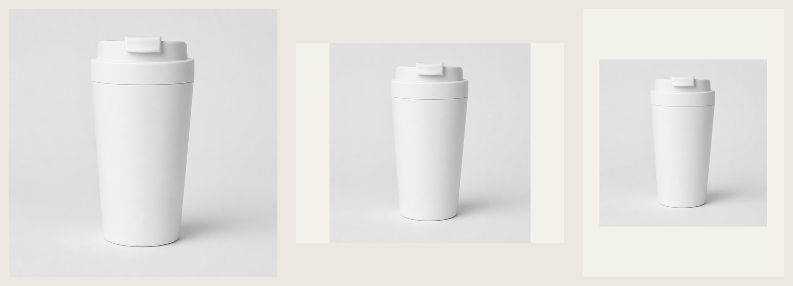

# 图片分支实测记录

## 调用链

- 本机测试入口不属于开源 Skill；公开记录只保留模型、通道、参数与结果
- 模型：GPT Image 2
- 通道：CCAPI 长请求直取结果
- 密钥：仅从 `CCAPI_API_KEY` / `CCAPI_IMAGE_API_KEY` 环境变量读取，未写入仓库或回执
- 参考图：`test-product-fixture.svg`，无第三方品牌或 Logo
- Prompt：`ccapi-prompt.txt`

## 实际生成结果

| 产物 | 方式 | 尺寸 |
|---|---|---:|
| [ccapi-product-master.png](ccapi-product-master.png) | GPT Image 2 / CCAPI | 1024×1024 |
| [ccapi-product-4x3.png](ccapi-product-4x3.png) | GPT Image 2 / CCAPI | 1024×768 |
| [taobao-main-800x800.png](taobao-main-800x800.png) | 从 1:1 主图派生 | 800×800 |
| [taobao-main-800x800.jpg](taobao-main-800x800.jpg) | 从同一派生图压缩的交付版 | 800×800，17,055 bytes |
| [showcase-1200x900.png](showcase-1200x900.png) | 从 1:1 主图留白派生 | 1200×900 |
| [douyin-content-1080x1440.png](douyin-content-1080x1440.png) | 从 1:1 主图留白派生 | 1080×1440 |
| [amazon-main-2048x2048.png](amazon-main-2048x2048.png) | GPT Image 2 / CCAPI 第一次 Amazon 适配尝试 | 2048×2048 |
| [amazon-main-2048x2048-v2.png](amazon-main-2048x2048-v2.png) | GPT Image 2 / CCAPI 第二次保真重试 | 2048×2048 |

## 人工检查

- 主体均为同一白色翻盖咖啡杯，没有 Logo、宣传文字或未经证实的功效声明。
- 派生尺寸没有重新调用模型创造不同产品。
- 淘宝主图的 PNG 派生文件为 520,836 bytes，超过两篇指定资料中的 500 KB 目标；改用同尺寸 JPG 交付版后为 17,055 bytes，尺寸和文件大小检查通过。
- 4:3 独立生成图与 1:1 主图结构接近，但发布时仍应选定一个产品视觉源作为唯一母版。
- 这些图片是工作流测试资产，不是实际商品证明或可直接发布的商品图。

## Amazon 2K 尝试：失败样例

两次 2K 文件和回执都真实生成成功，但平台图审核均判定为失败：

- 像素尺寸为 2048×2048，文件约 2.75 MB，满足指定资料中的尺寸和 10 MB 上限。
- 四角背景像素实测为 253-255 的近白值，不是严格一致的 RGB 255,255,255。
- 模型改变了原参考图的杯盖结构和杯体比例，违反“同一产品视觉源”的保真要求。
- 第二次通过更严格的“只换背景、不得改结构”提示重试；杯盖更接近参考图，但杯体仍被拉高、变窄，四角仍为 253-255 的近白值。
- 因此该文件只能作为失败证据，不能作为 Amazon 可用主图或 README 宣传案例。

生成成功、尺寸正确和平台可用是三件不同的事。本测试以产品结构和背景检查为准，没有把服务端返回成功当作发布通过。

结论：对需要严格商品保真的平台主图，优先使用真实产品图做确定性抠图、纯白换底和尺寸派生。GPT Image 2 / CCAPI 可继续用于场景草案，但本轮不证明它能独立承担保真主图制作。
