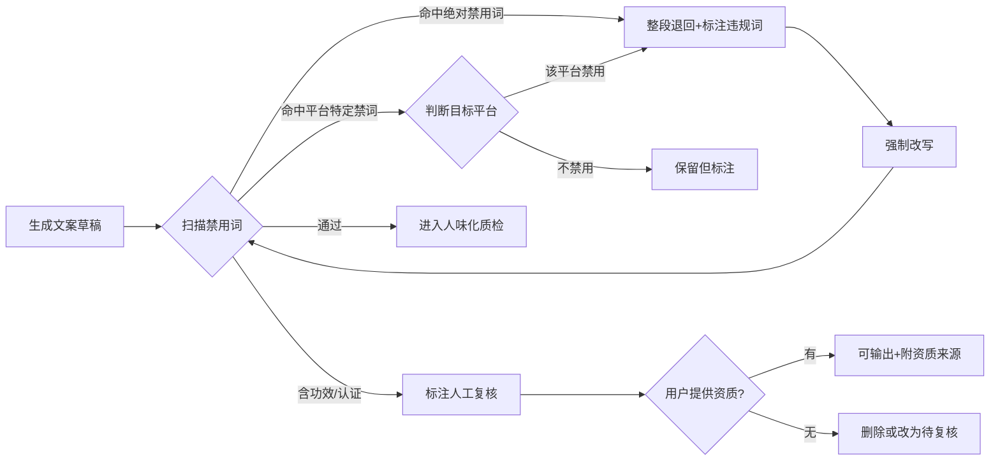

# 电商文案合规禁用词与拦截规则

## 用途

此文件是 `ai-ecommerce-workflow` 文案合规拦截门的完整参考。SKILL.md 里已经定义了核心流量和拦截流程，此文件提供各平台的详细禁词表和平台规则差异。

## 平台通用绝对禁用词（任何平台出现即拦截）

### 商标法/广告法红线

| 类型 | 禁用词示例 | 拦截原因 | 改写方向 |
|---|---|---|---|
| 极限词 | 最、第一、顶级、首个、首创、唯一、首家、首款、首套 | 广告法第九条，极容易罚款 | 删除，或替换为具体数字（"月销3000+"） |
| 绝对词 | 100%、纯天然、零添加、无副作用、永不、永久、绝对 | 无证据支撑即违规 | 换成可验证表述（"通过XX检测"需报告） |
| 国家级 | 国家级、国家、国级、世界级、全网、全国、全球 | 广告法禁止 | 删除，改为"本店爆款" |
| 品牌冒充 | 第一品牌、领导者、冠军、金牌、NO.1 | 需第三方认证 | 删除 |
| 虚假包装 | 极品、绝佳、极致、巅峰、卓越 | 空泛形容词，无证据 | 换具体细节 |

### 功效/安全类红线

| 类型 | 禁用词 | 拦截原因 |
|---|---|---|
| 治疗承诺 | 根治、治愈、痊愈、消炎、抗菌、抗病毒 | 药品/医疗器械/保健品才可写，普通商品禁止 |
| 减肥承诺 | 轻松减肥、快速瘦身、不反弹、燃脂、排油、瘦身 | 需保健食品批号 |
| 美容承诺 | 美白、祛斑、祛痘、抗敏、抗衰老、淡纹 | 化妆品特证才可写，普通商品禁止 |
| 安全承诺 | 安全无毒、无害、无辐射、零伤害 | 需检测报告 |
| 食品功效 | 增强免疫力、降血压、降血糖、助睡眠 | 需保健食品批号 |

### 平台规则红线

| 类型 | 禁用词 | 拦截原因 |
|---|---|---|
| 资质绑定 | 正品保证 | 需要品牌授权资质 |
| 平台绑定 | 假一赔十、假一罚万 | 需平台开通，非卖家自行承诺 |
| 服务虚标 | 支持专柜验货 | 多数品牌专柜不提供此服务 |
| 规则滥用 | 七天无理由退换、包退包换 | 需符合平台规则和商品类目 |

## 平台特定规则

### 淘宝

| 规则 | 内容 |
|---|---|
| 标题长度 | 30个汉字以内 |
| 核心词位 | 前8字必须是"核心词+属性词" |
| 标题重复 | 同一词不得出现2次以上 |
| 禁词 | 最、第一、全网、国家、权威、100%、绝对、永久 |
| 平台词禁 | 不得嵌入"淘宝网"、"天猫"作为标题关键词 |
| 功效词 | 护肤品化妆品必须特证才可写功效；食品不可写功效 |
| 认证词 | "通过XX认证"必须有认证编号或证书 |

### 拼多多

| 规则 | 内容 |
|---|---|
| 标题定位 | 价格词+场景词并重 |
| 禁词 | 同淘宝广告法红线，额外注意虚假拼单、已售数据 |
| 标价 | 必须真实，禁止低价引流后实际价格不符 |
| 销量 | 不得虚报已售数量 |

### 抖音电商

| 规则 | 内容 |
|---|---|
| 标题风格 | 场景化+口语化，多用"XX必备" |
| 禁词 | 同广告法红线，额外注意"不好用退钱"无边界 |
| 直播 | 不得虚假宣传、夸大功效、虚构原价 |
| 短视频 | 不得剪辑误导、价格与实际不符 |

### 亚马逊

| 规则 | 内容 |
|---|---|
| 标题长度 | 200字符以内 |
| 禁词 | "Best"、"#1"、"Guaranteed"、"Amazing"、"Perfect"、"Best Seller"(需要) |
| 促销 | 禁止在标题写促销信息（"Sale"、"Free Shipping"应在listing描述） |
| 认证 | "EC"、"FDA"、"CE"等认证需有文件支撑 |
| 评价 | 不得操纵评价、不得给差评买家退款要求修改 |

### 快手电商

| 规则 | 内容 |
|---|---|
| 标题风格 | 口语化+信任感 |
| 禁词 | 同广告法红线，额外注意绝对承诺、未成年人形象 |
| 功效词 | 禁止虚假功效宣传 |

### 1688/B2B

| 规则 | 内容 |
|---|---|
| 标题风格 | 参数+规格优先 |
| 禁词 | 同广告法红线，额外注意虚标起批量、虚假资质 |
| 起批量 | 必须真实可交付 |

## 拦截流程

## 人味化合规约束

人味化改写**不能**改变以下内容：
- 事实参数（尺寸、重量、容量、材质）
- 价格
- 售后承诺边界
- 认证编号（如有）
- 品牌授权信息（如有）

只能调整：表达方式、语序、连接词、形容词。
