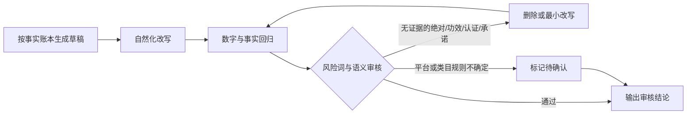

# 电商文案合规风险词与拦截规则

## 用途

此文件是 `ai-ecommerce-workflow` 安装包内的文案审核参考。风险词命中只负责定位，不等于自动判定违法；最终结合原句、商品品类、证据、目标地区和当前平台规则判断。平台长度、字段和禁限售规则易变化，正式上架前以当前后台为准。

## 通用高风险表达

### 商标法/广告法红线

| 类型 | 禁用词示例 | 拦截原因 | 改写方向 |
|---|---|---|---|
| 极限 / 排名 | 最、第一、顶级、首个、首创、唯一、首家、首款、首套 | 容易形成无法证明的绝对化、唯一性或排名宣称 | 删除；只有来源、范围、时间和资质都可核验时才按证据原文表达 |
| 绝对保证 | 100%、永不、永久、绝对、零风险、无副作用 | 容易变成结果、安全或性能保证 | 改为可测量事实和成立条件；`100% 棉`等成分值仍须标签 / 检测证据 |
| 权威 / 范围 | 国家级、世界级、全网、全国、全球、权威 | 容易暗示官方背书、覆盖范围或比较优势 | 无相应资格和范围证据时删除，不用“爆款”等另一种无证据词替换 |
| 品牌 / 荣誉 | 第一品牌、领导者、冠军、金牌、NO.1 | 可能涉及商标、荣誉、排名或比较证明 | 核验授权、奖项主体、年份和范围；否则删除 |
| 空泛包装 | 极品、绝佳、极致、巅峰、卓越、品质之选 | 缺少可判断的商品信息 | 换成买家能核对的尺寸、材料、结构、使用条件或包装内容 |

### 功效/安全类红线

| 类型 | 禁用词 | 拦截原因 |
|---|---|---|
| 治疗 / 疾病 | 根治、治愈、痊愈、消炎、抗病毒、预防疾病 | 普通商品不得作医疗宣称；受监管品类仍需核验许可范围和原文 |
| 体重 / 体形 | 轻松减肥、快速瘦身、不反弹、燃脂、排油 | 涉及健康功效和结果保证，不能从竞品文案或常识补写 |
| 美容功效 | 美白、祛斑、祛痘、抗敏、抗衰老、淡纹 | 按产品注册 / 备案、测试和目标市场规则核验，不做无证据功效承诺 |
| 安全 / 无害 | 安全无毒、无害、无辐射、零伤害、绝不过敏 | 需明确检测范围和使用条件；不得改写成绝对保证 |
| 食品 / 营养 | 增强免疫力、降血压、降血糖、助睡眠 | 普通食品不得写疾病或保健功效；受监管产品按许可范围复核 |

### 平台规则红线

| 类型 | 禁用词 | 拦截原因 |
|---|---|---|
| 资质绑定 | 正品保证 | 需要品牌授权资质 |
| 平台绑定 | 假一赔十、假一罚万 | 需平台开通，非卖家自行承诺 |
| 服务虚标 | 支持专柜验货 | 多数品牌专柜不提供此服务 |
| 规则滥用 | 七天无理由退换、包退包换 | 需符合平台规则和商品类目 |

## 平台特定规则

### 淘宝 / 天猫

| 规则 | 内容 |
|---|---|
| 类目与属性 | 当前叶子类目、关键属性、销售属性、SKU、标题、图片和详情保持一致 |
| 标题 | 品名和关键属性靠前；字符上限、重复词和类目要求按当前后台复核 |
| 品牌与平台词 | 不借用无关品牌、平台名或官方身份做搜索词 |
| 功效 / 认证 | 只按备案、检测、认证或授权文件的适用范围表达 |
| 价格与服务 | 优惠、赠品、发货、退换和质保必须与当前可兑现政策一致 |

### 京东

| 规则 | 内容 |
|---|---|
| 参数一致 | 品牌、型号、规格参数、SKU、图片和详情不得互相冲突 |
| 认证 / 能效 | 认证、能效、检测和保修只引用可核验文件与适用型号 |
| 价格 / 促销 | 不虚构原价、折扣、库存、赠品或限时信息 |

### 拼多多

| 规则 | 内容 |
|---|---|
| 标题与规格 | 品名、规格、数量和 SKU 清楚，不靠无关热词或低价占位引流 |
| 禁词 | 同淘宝广告法红线，额外注意虚假拼单、已售数据 |
| 标价 | 必须真实，禁止低价引流后实际价格不符 |
| 销量 | 不得虚报已售数量 |

### 抖音电商

| 规则 | 内容 |
|---|---|
| 标题 / 口播 | 商品卡、短视频、口播、画面演示和落地页事实一致；“必备”也需删除或改成具体适用场景 |
| 禁词 | 同广告法红线，额外注意"不好用退钱"无边界 |
| 直播 | 不得虚假宣传、夸大功效、虚构原价 |
| 短视频 | 不得剪辑误导、价格与实际不符 |

### 亚马逊

| 规则 | 内容 |
|---|---|
| 标题 | 长度和类目格式按当前站点后台复核；不塞促销、排名和无关关键词 |
| 高风险词 | `Best`、`#1`、`Guaranteed`、`Perfect`、`Best Seller` 等比较 / 保证表达需要规则允许和证据 |
| 促销 | 标题和要点不写易变促销、价格、配送承诺或卖家联系方式 |
| 认证 | FDA、CE 等监管或认证表述必须有文件，并准确说明适用产品和含义 |
| 评价 | 不得操纵评价、不得给差评买家退款要求修改 |

### eBay

| 规则 | 内容 |
|---|---|
| 状态与缺陷 | 新旧状态、缺陷、维修 / 翻新、真伪、包装内容如实写明 |
| Item specifics | 类目属性、标题、图片和描述一致，不用正文掩盖结构化字段冲突 |
| 物流与退换 | 处理时间、运费、关税、退换和所在地使用卖家真实政策 |

### Etsy

| 规则 | 内容 |
|---|---|
| 商品资格 | 手工、复古、工艺材料、设计与生产伙伴等身份按平台当前规则如实选择 |
| 材料与工艺 | 不虚构手工过程、材料、年代、产地或个性化能力 |
| 交付 | 制作时间、数字 / 实物交付、尺寸、颜色差异和退换条件写清 |

### Shopify

| 规则 | 内容 |
|---|---|
| 目标市场 | 独立站仍需遵守销售地区的广告、消费者、隐私和品类监管规则 |
| 页面一致 | 产品页、SEO、广告落地页、变体、库存、配送和退换政策互相一致 |
| 社会证明 | 不伪造评价、媒体引用、认证、稀缺、倒计时或销量 |

### AliExpress

| 规则 | 内容 |
|---|---|
| 品牌与知识产权 | 品牌名、Logo、兼容词和授权有依据，不借用无关商标引流 |
| 跨语言一致 | 标题、参数、尺寸、包装、兼容和限制在不同语言版本中不漂移 |
| 价格与物流 | 折扣、数量、运费、税费、发货时效和退换口径与实际设置一致 |

### 快手电商

| 规则 | 内容 |
|---|---|
| 标题 / 直播 | 商品页、直播、短视频和主播承诺保持一致，口语化不能替代事实 |
| 禁词 | 同广告法红线，额外注意绝对承诺、未成年人和功效演示 |
| 功效词 | 禁止虚假功效宣传 |

### 1688/B2B

| 规则 | 内容 |
|---|---|
| 标题风格 | 参数+规格优先 |
| 禁词 | 同广告法红线，额外注意虚标起批量、虚假资质 |
| 起批量 | 必须真实可交付 |

## 拦截流程

## 人味化合规约束

人味化改写**不能**改变以下内容：
- 事实参数（尺寸、重量、容量、材质）
- 价格
- 售后承诺边界
- 认证编号（如有）
- 品牌授权信息（如有）

只能调整：表达方式、语序、连接词和不改变事实的形容词。改写后重新运行本文件审核，不能因为上一版通过就跳过。

## 审核输出

每次审核输出：

1. `结论`：`可作为上架草案` / `修改后复核` / `缺证据，暂不输出`；不写“保证过审”。
2. `问题表`：原文位置、原句、风险类型、所需证据、最小修改和处理状态。
3. `修订稿`：只改问题句，不顺手重写已通过内容。
4. `复核项`：事实账本、平台字段、禁限售 / 类目、目标地区和当前后台规则。

本文件不是法律意见或平台审核结果。详细审核流程见同目录 `listing-compliance-review.md`。
